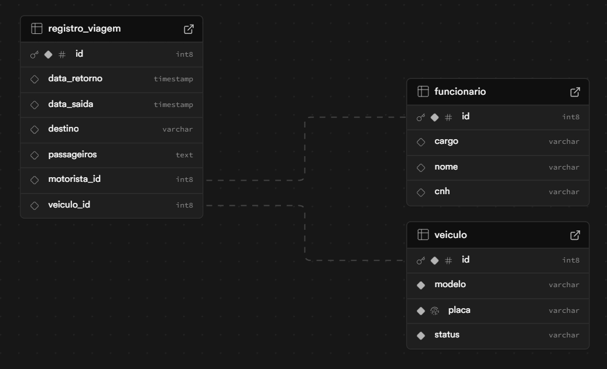

criação do projeto -> https://start.spring.io/

rodar a API -> .\gradlew.bat bootRun

metodos prontos (CRUD) -> JpaRepository

DIFICULDADES: Estou acostumado a criar op mer na mão, com SQL, já fiz o uso de Quarkus, para uma API, na faculdade. Utilizar uma freameWork é muito fera, facilita muito.
hoje descobri que a anotação @ManyToOne faz o gerenciamento das chaves estrangeiras, criando as na tabela.

